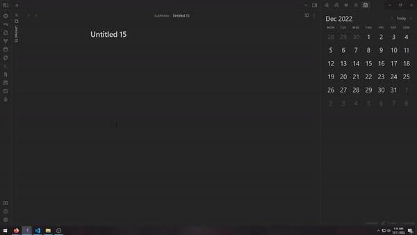
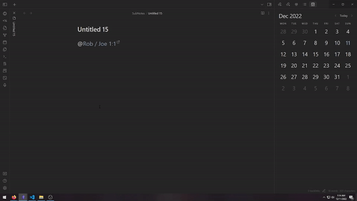

The @Annotation allows you to reference Google Calendar events inside a note by typing typing `@` followed by a date or a keyword like `today` or `tomorrow` then select the event you want to insert.

Possible options are:

- `@today`
- `@tomorrow`
- `@yesterday`
- `@+n` where n is a number
- `@-n` where n is a number
- `@<date>` where date is a date in the format `YYYY-MM-DD`
- `@<date>` where date is a date in the format `MM-DD-YYYY` you can switch to german format with the [[UsDateFormat]] Setting.

> Type a space to confirm your input and trigger the selection menu

After inserting the event, the plugin will know that every reference made is related to this event.

You can insert information inside a note by writing `{{gEvent.<Any option>}}`

> Type a space to confirm your input and trigger the insert

When there a multiple events inserted in one note add a zero based index to gEvent to select the event.
When the note is an [[EventNote]] the first event will always be the event linked to the note by the id in the frontmatter.

`{{gEvent<index>.summary}}`
