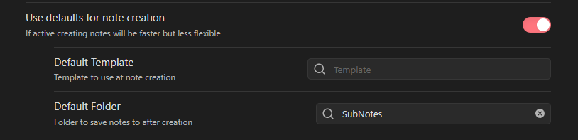
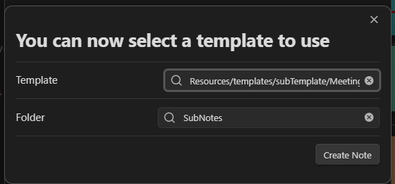

An "Eventnote" is a note that is directly linked to an Google event.
This connection is achieved by the existence of the `event-id` value in frontmatter of the note.

Example:

~~~md title="Eventnote example"
---
event-id: 1234567890ABCDEF
---

# My note title

My note content
~~~

## Features

Event notes have some advantages over normal notes:

- The event note can be opened from the [[EventDetailsView]]
- You can insert event details as plaintext. See [[EventDataInsertion]] for more information.
- You can update the linked Google Event with the frontmatter of the note. See [[EventFrontmatter]] for more information.

## Create Eventnote

There are multiple options to create an Eventnote:

- manually create a note and add the `event-id` frontmatter with the id of the event you want to link
- Use the `Create EventNote` button in the [[EventDetailsView]]
- Use the [[AutoImport]] feature to automatically create Eventnotes for all events in your calendar

### Templates

To configure the content that is inserted, when the Eventnote is created, you can use a template file.
The plugin supports the core template and the [Templater](https://github.com/SilentVoid13/Templater) plugin.

To insert event details into the note you the following syntax:

~~~md
{{gEvent.propertyName}}
~~~

All [properties of the Google Calendar Event](https://github.com/YukiGasai/obsidian-google-calendar/blob/0518e3f6f1943645ecf9bfc747e046ab9d92b871/src/suggest/GoogleEventSuggestionList.ts#L121C1-L246) can be used.

Example:

~~~md title="Template example"
# My note title
{{gEvent.description}}

My note content
~~~

To create more complex templates I recommend using the  [Templater](https://github.com/SilentVoid13/Templater) plugin.
You can use the same syntax as above to insert event details into the template and can use all the features of the Templater plugin.
This allows you to, for example format the dates.
This is possible, because the event details are resolved before templater is run.

~~~md title="Templater example"
---
type: event
location: "{{gEvent.location}}"
MOCs:
  - "[[Events MOC]]"
  - "[[<% window.moment('{{gEvent.start.date}}' != '' ? '{{gEvent.start.date}}' : '{{gEvent.start.dateTime}}').format('YYYY-MM-DD-dddd') %>]]"
---
<% await tp.file.move("/Extras/Events/" + window.moment('{{gEvent.start.date}}' != '' ? '{{gEvent.start.date}}' : '{{gEvent.start.dateTime}}').format('YYYY-MM-DD') + " " + tp.file.title) %>
# [[<% window.moment('{{gEvent.start.date}}' != '' ? '{{gEvent.start.date}}' : '{{gEvent.start.dateTime}}').format('YYYY-MM-DD') + " " + tp.file.title %>]]
{{gEvent.description}}

Note content
~~~

If you need even more complex templates you can use the [[ObsidianGoogleCalendarAPI | Obsidian Google Calendar API]] with [Templater](https://github.com/SilentVoid13/Templater).

### Options

Inside the [[PluginOptions | Plugin Options]] you can configure a default template to use for all Eventnotes as well as a default location. If you don't configure defaults, the plugin will ask you for a template and location every time you create an Eventnote.

The setting for the default template.

The popup to select a template when creating an Eventnote.
