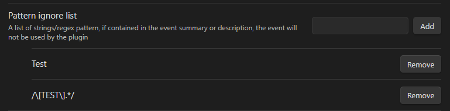

The ignore pattern list can be used to filter out events by their title and description.
If events match any of the patterns they will be ignored by the plugin and not appear in any of the views or other functions.

A list item an be a simple string or a regular expression.
If it is a string the plugin will check if the title or description of the event contains the string.
If it is a regular expression the plugin will check if the title or description of the event matches the regular expression.

## Example

