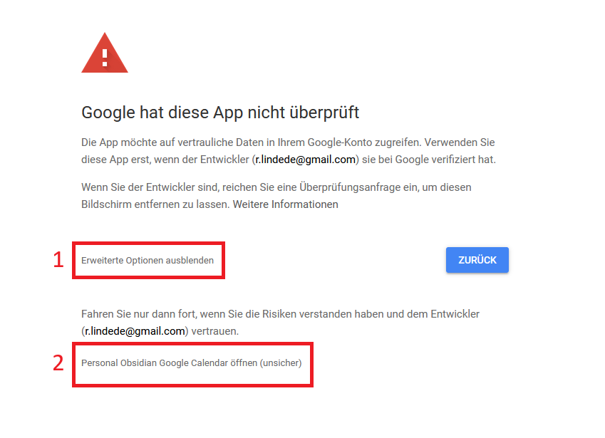

The installation of this plugin is a little cumbersome.
But after the initial setup you should never have to touch it again.
The creation of a public OAUTH client to skip this setup is WIP.

## Install Plugin

- One click install from [community plugin store](obsidian://show-plugin?id=google-calendar)
- Go to settings and activate plugin

## Setup Google Calendar plugin

The required URLS for the google cloud project are:

- Authorized JavaScript origins:
  - `http://127.0.0.1:42813`
  - `https://google-auth-obsidian-redirect.vercel.app`
- Authorized redirect URIs:
  - `http://127.0.0.1:42813/callback`
  - `https://google-auth-obsidian-redirect.vercel.app/callback`

<object data="Install.pdf" type="application/pdf" width="700px" height="700px">
    <embed src="Install.pdf">
        
This browser does not support PDFs. Please download the PDF to view it: <a href="Install.pdf">Download PDF</a>.

    </embed>
</object>

A video showing the creation of the google cloud project can be found [here](https://youtu.be/TMQ8HZjeauo)

## Login

- Go into the plugin settings
- Enable the [[UseCustomClient]] setting
- Insert your [[GoogleClientId]] and [[GoogleClientSecret]] in the input fields
- Press Login
  - A browser window will open
- Login / Select your google account
- Google will display a warning that the app is not verified
  1. Click on advanced
  2. Click on go to {project name} (unsafe)
  - The browser will redirect to the consent screen
- Click on allow (Make sure to allow all scopes)

> Google does not require verification for internal use.
> This means you can use your unverified app with your google account, as long as you don't share it with others.
