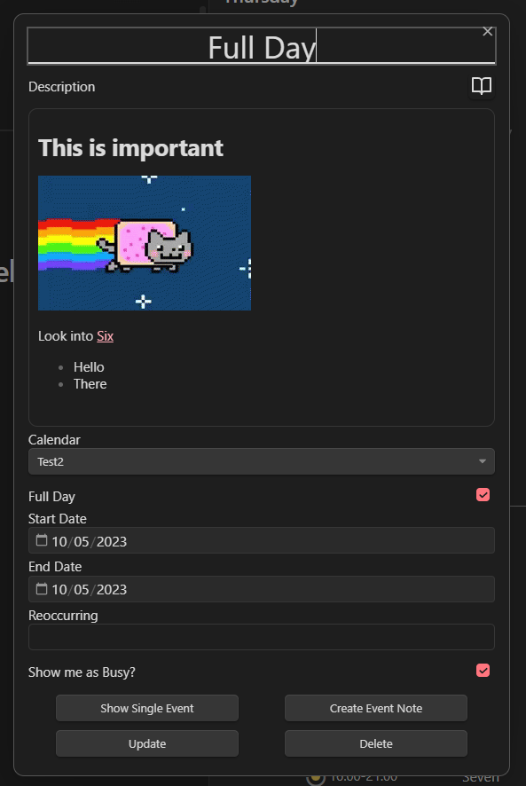

The EventDetails View is used to display the details of an event.
It can be opened by clicking on an event in the [[TimelineView]], [[WeekView]], [[MonthView]], [[ScheduleView]] or [[YearView]].
By holding `shift` while pressing on an event this view is opened in a separate view, instead of a modal.

## Functionality

The EventDetails View displays:

- The title of the event (summary)
- The description of the event
- The start and end date of the event
- The calendar the event belongs to
- The recurrence of the event
- The busy status of the event

### Description

The description can be toggled between the rendered and the raw markdown version.
This can be done by clicking on the `Book` button in the top right corner of the view.
The google calendar supports basic html syntax in the description.
The view transforms this html to markdown and displays it.
This can lead to some unexpected results.
Besides the default markdown features like images, links and lists, Obsidian Links are also supported.

### Date

When selecting a date, make sure the start date is before the end date.
Otherwise the event will not be saved.
If you want to create an all day event, make sure the all day checkbox is checked.

### Calendar

The calendar can be selected on the calendar dropdown. Like the other options except `reoccurring`, this can be changed after the event is created.
Please make sure to give the selection of the calendar some time to load, because it uses another update method than the other options.

### Recurrence

The recurrence of the event can only the set when creating the event.
It allows you to define the recurrence rules in a human readable way.
To test your options, please use this website: [RRULE Editor](https://jakubroztocil.github.io/rrule/).
The plugin uses the [rrule](https://www.npmjs.com/package/rrule) library to parse the recurrence rules.

### Actions

The buttons in the bottom of the view allow you to:

- Open the event in the Google Calendar Web App
- Create / Open the [[EventNote]] of the event
- Save / Update the event
- Delete the event
- Save / Update the event and all reoccurring events (only if its a reoccurring event)
- Delete the event and all reoccurring events (only if its a reoccurring event)

## Example

